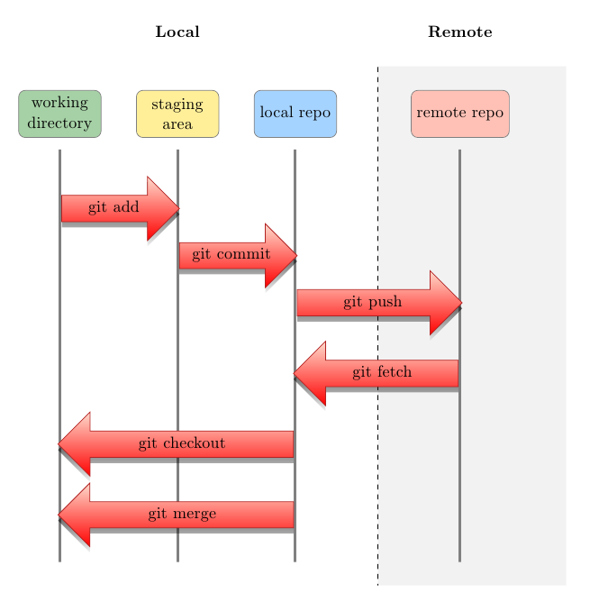

[TOC]

# Gentle Introduction to Git
__for the Collaboration on *landsat-albedo* Repository__

Learn briefly and quickly about Git and how to use it with specific
examples targeting at our repository of *landsat-albedo* for
SPECTRALMASS members.

## What is version control system (VCS), Git, GitHub and Bitbucket?

We suggest the
[Git tutorial](https://www.atlassian.com/git/tutorials/) given by
[Atlassian](https://www.atlassian.com/) as an introduction to learn
more details about VCS and all its related concepts and tools. Here we
draw some important words from the tutorial and some other resources
for a quick learn.

* Version control system

From
[the tutorial](https://www.atlassian.com/git/tutorials/what-is-version-control):

> Version control systems are a category of software tools that help a
software team manage changes to source code over time. Version control
software keeps track of every modification to the code in a special
kind of database. If a mistake is made, developers can turn back the
clock and compare earlier versions of the code to help fix the mistake
while minimizing disruption to all team members.

* Git

Git is just one of many VCSs. The existing VCSs include as the early
one like [Subversion or SVN](https://subversion.apache.org/), or as
some latest ones like
[Mercurial or Hg](https://www.mercurial-scm.org/) and
[Git](https://git-scm.com/). 

From
[the tutorial](https://www.atlassian.com/git/tutorials/what-is-git):

> By far, the most widely used modern version control system in the
> world today is Git. Git is a mature, actively maintained open source
> project originally developed in 2005 by Linus Torvalds, the famous
> creator of the Linux operating system kernel.

* GitHub and Bitbucket

While you can simply use a VCS to manage your own source code on your
local computers, most likely you need to work on a source code
together with the others or you want others to download/access your
code for actual uses. Now we need a place to store a repository of the
source code where general public can access and your teammates can
exchange modifications. This place should be a host server that deals
with file access, download and upload. You can set up a local server
just for your own team privately but that would need a lot of
work. Many commercial companies provide such hosting service for
repository storage, including two of the most popular ones mentioned
here: [GitHub](https://github.com/) and
[Bitbucket](https://bitbucket.org/)

GitHub is totally free for public repositories but charges you for
private repositories. Many programmers, scientists and organizations
store their source code there for collaborative work and
sharing/advertizing of their programs, including some familiar names
in our research field: [USGS](https://github.com/USGS-EROS),
[librat](https://github.com/UCL-EO), and
[ESA's Sentinel-2 atmoshpere correction](https://github.com/umwilm/SEN2COR).

Bitbucket provides free public repositories and for users in academia
five free private repositories. Our repository of *landsat-albedo*
right now sits on Bitbucket as a private repository.

## Install Git on our Linux servers

Most Linux systems now come with Git pre-installed, though sometimes
the version might be old. UMB IT service just installed the latest Git
V2.9.0 on Neponset. You are all set to use on Neponset. If you plan to
install Git by yourself, refer to
[the guide of installation](https://git-scm.com/book/en/v2/Getting-Started-Installing-Git).

## First-time Git set up

Before you start using Git, you need to make a few settings, such as
your identity (so that when you push/upload your source code changes
to the hosting server, your teammates can recognize you.), your text
editor used by Git and etc..

Follow
[the guide to Git setup](https://git-scm.com/book/en/v2/Getting-Started-First-Time-Git-Setup)
to make these settings.

## Simple example on the usage of Git

### Manage your source code on Neponset with Git
  
  * Set up a directory, say, *sample-repo* of source code.
    
        $ mkdir sample-repo
        $ cd sample-repo
    
  * Initiate a Git repository in this directory.
  
        $ git init
    
  * Check the status of your fresh repository.
  
        $ git status
    
  * Use your preferred text editor to create a sample code file, say,
    *sample_src.txt*.

  * Check the status again.
  
        $ git status
    
    Now you may see, 
    
        On branch master

        Initial commit

        Untracked files:
          (use "git add <file>..." to include in what will be committed)

            sample_src.txt

            nothing added to commit but untracked files present (use "git add" to track)

  * Tell Git to track the changes of our file/s and prepare to record
    changes.
    
    Track the file *sample_src.txt*
    
        $ git add sample_src.txt
        
    Track all the files in the working directory, more preferrably used.
        
        $ git add --all
        
  * Commit your changes. 
  
        $ git commit -m "my words to explain this commit of changes to the code"
        
    Git will remember which file has been changed by this commit. What you can also do is, 
    
        $ git commit
        
    It will then open the text editor you have set up for Git
    earlier. You can write your messages for the commit there, save it
    and close the editor. This allows you to write more sophiscated
    messages, e.g. including double quotes and other special
    characters in your text editor.
    
  * Check what's changed.
  
    Lists the changes that have been commited so far so that you can
    track changes.
        
        $ git log
        
    Now if you edit the content of *sample_src.txt*, say adding one
    line of `I updated my source code file.`, the following will show
    the difference between your current code (before commit) and the
    last commit.
    
        $ git diff
        
    You may see, 
    
        diff --git a/sample_src.txt b/sample_src.txt
        index e69de29..4843284 100644
        --- a/sample_src.txt
        +++ b/sample_src.txt
        @@ -0,0 +1 @@
        +I updated my source code file.
        
  * Undo your changes.
  
    Follow
    [this guide](https://www.atlassian.com/git/tutorials/undoing-changes/git-clean)
    for undoing your changes at different stages of your changes.
        
### Work between local Git repository and remote repository for teamwork

Now you can manage your source code and track its changes with Git on
your local computers (by *local*, we mean a computer that's not a
repository hosting server. When you write your code on Neponset, here
in this context we still say Neponset is a local computer as it does
not provide repository hosting servcie for people other than you to
access and/or modify). 

But this local repository of your own is not enough if you and your
teammates are working on a project together. For example, our
*landsat-albedo* repository currently is under frequent updating by at
least three of our group members, Qingsong, Yanmin, and Zhan. Whenever
one person fixes a bug or makes an enhancement, all the others have to
copy the new code, inspect changes manually, reconcile conflicts with
their own on-going changes, and then update their code
cautiously. This is a rather exhausting, inefficient and also
dangerous way to teamwork on a project as very soon everyone is likely
to lose track of which code copy is the latest version and which
change is correct and which causes troubles.

One way, probably currently the best way, is to set up a remote
repository on a hosting server and everyone upload/push their own
changes and download/pull the others' to the source code. When you use
Git to push and pull changes, it will automatically check conflicts
and ask you to fix it before updating your local repository or the
shared remote repository. Notice here we use **push** and **pull** to
describe the upload and download from the remote repository, which are
the jargon in Git. You will hear and use them a lot.

  * __Important! Set up SSH key for access to your remote repository__
  
    There are two protocols to communicate between your local
    repository and your remote repository on GitHub or Bitbucket, (1)
    https and (2) ssh. It determines what the URL to your remote
    repository will look like and be used by Git.
    
    For example, for our *landsat-abeldo* remote repository on
    Bitbucket,
    
    1. URL to our remote repository via https
      
             https://Woodstonelee@bitbucket.org/Woodstonelee/landsat-albedo.git
           
    2. URL to our remote repository via ssh
    
             git@bitbucket.org:Woodstonelee/landsat-albedo.git
           
    Using https, easier to set up, but every time you talk to the
    remote repository from your local repository with Git, you have to
    enter your password to your Bitbuckt or GitHub, whichever your
    remote repository resides on.
    
    Using ssh, more difficult to set up, however, you can easily and
    safely talk to your remote repository without entering your
    password all the time. We are going to use SSH key to access our
    remote repository. Setting up SSH key is not so easy **but not
    intimidating**!. **Do allow yourself enough time to go through the
    steps below to set up your SSH key.** If you have trouble
    following the steps, ask Zhan Li to help.
    
    * [Guide to set up SSH key for remote repositories on Bitbucket](https://confluence.atlassian.com/bitbucket/set-up-ssh-for-git-728138079.html)
    * [Guide to set up SSH key for remote repositories on GitHub](https://help.github.com/articles/generating-an-ssh-key/#platform-mac)

  * Create your remote repository. 
  
    * [How to on Bitbucket](https://confluence.atlassian.com/bitbucket/create-a-git-repository-759857290.html)
    * [How to on GitHub](https://help.github.com/articles/creating-a-new-repository/)
  
  * Tell the URL to your remote repository to the local repository. 
  
    I have created a public remote repository on Bitbucket called
    [sample-repo](https://bitbucket.org/Woodstonelee/sample-repo). The
    URL to this repository via ssh is
    `git@bitbucket.org:Woodstonelee/sample-repo.git`. Now I'm going to
    let my local repository know this URL so that Git can push and
    pull changes to and from the remote repository.
  
        $ cd /path/to/my/repo
        $ git remote add origin git@bitbucket.org:Woodstonelee/sample-repo.git
        
  * Push committed changes on your local repository to the remote. 
  
        $ git push -u origin --all # pushes up the repo and its refs for the first time
        
  * Pull changes on the remote repository to your local repository.
  
    Get changes from the remote repository. 
    
        $ git fetch
        
    Examine these changes by comparing the fetched changes with your
    local repository.
    
        $ git diff master origin/master
        
    Where `master` is the main branch name of your local repository
    and `origin/master` is the main branch name of your remote
    repository you have just fetched. To know more about the concept
    of *branch* in Git, refer
    [here](https://www.atlassian.com/git/tutorials/using-branches) and
    for even deeper information
    [here](https://git-scm.com/book/en/v1/Git-Branching-What-a-Branch-Is). Though
    *branch* is an important and unique core feature of Git, we are
    not going to cover it here as it needs much more time.

## Review of the big picture of a typical Git workflow

To summarize what we have learned so far for a typical Git workflow,
here is a diagram from
[a StackExchange question](http://tex.stackexchange.com/questions/70320/workflow-diagram).

  More words to help understand the diagram:
  
  * working directory: this is simply the directory of your source
    code, you make changes and run your code from here.
  * staging area and local repo: these two are a storage space set up
    by Git when you do `git init` in your source code
    directory. Specifically, in your source code directory or working
    directory, you will notice a hidden folder called `.git` (use `ls
    -a` in a nix-system terminal to see it).

## Use Git to collaborate on our *landsat-albedo* repository

Our *landsat-albedo* source code sits on Bitbucket as a private
repository. If you need access to the repository to go through the
following guide, send your Bitbucket user name or email to Zhan Li.

  * Clone the remote repository to your local computer.
        
        $ git clone git@bitbucket.org:Woodstonelee/landsat-albedo.git
        
  * Check the commits we have so far. 
  
        $ git log
        
  * Always `git add --all` after you make some changes.
  * Often `git commit` after you are satisfied with your change and
    write informative words for the commit.
  * Push your updates to the remote repository via `git push`!

